### 1.  Пояснительная записка. Микросервисное приложение "E-commerce" на Kubernetes с Istio

## Оглавление
1.  [Обзор](#обзор)
2.  [Термины и определения](#термины-и-определения)
3.  [Архитектура приложения](#архитектура-приложения)
    *   [Описание микросервисов](#описание-микросервисов)
    *   [Архитектура K8s и Istio](#архитектура-k8s-и-istio)
    *   [Сетевое взаимодействие](#сетевое-взаимодействие)
4.  [Схема архитектуры данного приложения](#схема-архитектуры-данного-приложения)
5.  [Типовая схема архитектуры микросервисов в Kubernetes](#типовая-схема-архитектуры-микросервисов-в-kubernetes)
6.  [Установка и запуск](#установка-и-запуск)
7.  [Роль Docker Registry и Docker Hub](#роль-docker-registry-и-docker-hub)
8.  [Объяснение mTLS](#объяснение-mtls-mutual-tls)
9.  [Масштабируемость в Kubernetes (HPA)](#масштабируемость-микросервисов-в-kubernetes-hpa)
10. [Уязвимости в безопасности приложения](#уязвимости-в-безопасности-приложения)
11. [Инструменты для мониторинга](#инструменты-для-мониторинга)
    *   [Minikube Dashboard](#minikube-dashboard)
    *   [Kiali + Prometheus](#kiali--prometheus)

## Обзор
Это платформа для электронной коммерции, построенное на основе 6 контейнеризированных микросервисов. Проект демонстрирует современные DevOps практики, включая оркестрацию с помощью Kubernetes, использование Service Mesh (Istio) для безопасного взаимодействия (mTLS), горизонтальное автомасштабирование подов (HPA) и централизованную маршрутизацию трафика.

Приложение разворачивается в локальном кластере Minikube.

## Термины и определения
- **Docker**: Платформа для разработки, доставки и запуска контейнеризированных приложений.
- **Контейнер**: Изолированная среда для запуска приложения со всеми его зависимостями.
- **Docker Hub**: Облачный сервис (registry) для хранения и распространения образов контейнеров Docker.
- **Kubernetes (K8s)**: Открытая платформа для автоматизации развертывания, масштабирования и управления контейнеризированными приложениями.
- **Minikube**: Инструмент для локального запуска одноузлового кластера Kubernetes на персональном компьютере.
- **Pod**: Наименьшая развертываемая единица в Kubernetes, которая может содержать один или несколько контейнеров.
- **Service**: Абстракция, которая определяет логический набор подов и политику доступа к ним. Обеспечивает service discovery внутри кластера.
- **Deployment**: Объект K8s, который управляет жизненным циклом подов, обеспечивая их желаемое количество (replicas) и возможность обновлений (rolling updates).
- **Istio**: Платформа service mesh, которая предоставляет возможности для управления трафиком, обеспечения безопасности (включая mTLS), сбора телеметрии и отказоустойчивости на уровне сети, не требуя изменений в коде самих приложений.
- **mTLS (Mutual TLS)**: Протокол взаимной аутентификации, при котором и клиент, и сервер проверяют сертификаты друг друга перед установкой защищенного соединения. Istio использует mTLS для шифрования всего трафика между микросервисами внутри кластера.
- **Istio Gateway**: Компонент Istio, который управляет входящим (и исходящим) трафиком на границе service mesh. Работает в паре с `VirtualService`.
- **VirtualService**: Ресурс Istio, который определяет правила маршрутизации для трафика, поступающего через `Gateway`.

## Архитектура приложения

### Описание микросервисов
Приложение состоит из следующих сервисов:

| Сервис | Порт контейнера | Описание | Docker образ |
|---|---|---|---|
| **product-service** | `5001` | Управление каталогом товаров. | `drjabber/product-service:latest` |
| **order-service** | `5002` | Обработка заказов (взаимодействует с `product-service`). | `drjabber/order-service:latest` |
| **recommendation-service** | `5003` | Предоставление персональных рекомендаций. | `drjabber/recommendation-service:latest` |
| **user-service** | `5004` | Управление аккаунтами пользователей. | `drjabber/user-service:latest` |
| **inventory-service** | `5005` | Управление остатками на складе. | `drjabber/inventory-service:latest` |
| **swagger-ui-service** | `5006` | Агрегированная Swagger UI документация для всех API. | `drjabber/swagger-ui-service:latest` |

### Архитектура K8s и Istio
- **Пространство имен (Namespace)**: Все компоненты приложения развертываются в отдельном пространстве имен `retail` для изоляции от других приложений в кластере.
- **Sidecar Injection**: Для пространства имен `retail` включена автоматическая инъекция прокси-контейнеров Istio (`istio-proxy`). Это означает, что в каждый под приложения автоматически добавляется sidecar-контейнер Envoy, который перехватывает весь сетевой трафик.
- **Развертывание (Deployments)**: Каждый микросервис управляется собственным `Deployment`, который обеспечивает запуск необходимого числа реплик (подов).
- **Сервисы (Services)**: Для каждого `Deployment` создан `Service` типа `ClusterIP`. Это позволяет другим сервисам внутри кластера обращаться к нему по стабильному DNS-имени (`<service-name>.retail.svc.cluster.local`).

### Сетевое взаимодействие
- **Внешний трафик**:
  1.  Пользователь отправляет запрос на домен `http://mariia.local`.
  2.  Запрос попадает на **Istio Ingress Gateway** (`istio-ingressgateway`), который является точкой входа в кластер. Его внешний IP-адрес можно получить командой `minikube service istio-ingressgateway -n istio-system --url`.
  3.  Ресурс Istio `Gateway` (`retail-gateway`) настроен на прослушивание порта 80 для хоста `mariia.local`.
  4.  Ресурс Istio `VirtualService` (`retail-virtualservice`) анализирует путь запроса (например, `/product/...`) и, согласно правилам, направляет трафик на соответствующий внутренний `Service` Kubernetes (например, `product-service`).
- **Внутренний трафик (Service-to-Service)**:
  1.  Взаимодействие между сервисами (например, `order-service` вызывает `product-service`) происходит по внутренним DNS-именам Kubernetes (например, `http://product-service/1`).
  2.  Весь этот трафик перехватывается прокси-контейнерами `istio-proxy`.
  3.  Благодаря политике `PeerAuthentication` (`istio-mtls-policy.yaml`) с режимом `STRICT`, Istio автоматически устанавливает **mTLS-соединение** между прокси.
  4.  Это гарантирует, что весь трафик внутри кластера между микросервисами зашифрован и аутентифицирован, даже если сами приложения общаются по обычному HTTP.

## Схема архитектуры данного приложения
Эта схема детально описывает компоненты и потоки данных в приложении, развернутом в Minikube с Istio.

```plantuml
@startuml
!theme plain
skinparam componentStyle uml2
title Архитектура приложения E-commerce в K8s с Istio (с несколькими подами)

' --- Определяем участников и внешнюю среду ---
actor "Пользователь" as User

' --- Определяем кластер Kubernetes ---
node "Minikube Cluster (Worker Node)" {

    ' --- Неймспейс istio-system ---
    package "Namespace: istio-system" #LightSkyBlue {
        [istio-ingressgateway\n(LoadBalancer Service)] as GatewayProxy
    }

    ' --- Неймспейс приложения ---
    package "Namespace: retail" #LightGreen {

        [Gateway CRD\n(retail-gateway)] as IstioGatewayCRD
        [VirtualService CRD\n(retail-virtualservice)] as VS
        IstioGatewayCRD -[hidden]- VS


        frame "Deployment: product-deployment" {
            frame "Pod 1" as PPod1 {
                [product-app] as PApp1
                [istio-proxy] as PProxy1
            }
            frame "Pod 2" as PPod2 {
                [product-app] as PApp2
                [istio-proxy] as PProxy2
            }
        }

        [Service: product-service] as ProductSvc

        frame "Deployment: order-deployment" {
            frame "Pod 1" as OPod1 {
                [order-app] as OApp1
                [istio-proxy] as OProxy1
            }
            frame "Pod 2" as OPod2 {
                [order-app] as OApp2
                [istio-proxy] as OProxy2
            }
        }
        [Service: order-service] as OrderSvc

        frame "Deployment: user-deployment" {
            frame "Pod 1" as UPod1 { 
                [user-app] - [istio-proxy] 
            }
            frame "Pod 2" as UPod2 { 
                [user-app] - [istio-proxy] 
            }
        }
        [Service: user-service] as UserSvc

        frame "Deployment: inventory-deployment" {
            frame "Pod 1" { 
                [inventory-app] - [istio-proxy] 
            }
            frame "Pod 2" { 
                [inventory-app] - [istio-proxy] 
            }
        }
        [Service: inventory-service] as InventorySvc

        frame "Deployment: recommendation-deployment" {
            frame "Pod 1" { 
                [recommendation-app] - [istio-proxy] 
            }
            frame "Pod 2" { 
                [recommendation-app] - [istio-proxy] 
            }
        }
        [Service: recommendation-service] as RecoSvc

        frame "Deployment: swagger-ui-deployment" {
            frame "Pod 1" { 
                [swagger-ui-app] - [istio-proxy] 
            }
            frame "Pod 2" { 
                [swagger-ui-app] - [istio-proxy] 
                }
        }
        [Service: swagger-ui-service] as SwaggerSvc
    }
}

' --- Потоки данных ---

' 1. Внешний трафик от пользователя
note right of User
  Запрос на
  http://mariia.local/product/list
end note
User --> GatewayProxy : "HTTP (port 80)"

' 2. Маршрутизация внутри Istio
GatewayProxy --> VS : "1. Входящий трафик"
VS --> ProductSvc : "2. VirtualService маршрутизирует\n   запрос /product/*"
VS --> OrderSvc
VS --> UserSvc
VS --> InventorySvc
VS --> RecoSvc
VS --> SwaggerSvc

' 3. Балансировка нагрузки Kubernetes Service на поды
ProductSvc ..> PPod1 : "3. Service балансирует\n    нагрузку между подами"
ProductSvc ..> PPod2

' 4. Пример внутреннего вызова (service-to-service) с mTLS
note "Внутренний вызов: Order -> Product" as InternalCallNote
InternalCallNote .. OPod1

OApp1 ..> OProxy1 : "4. HTTP запрос из app-контейнера"
OProxy1 -[#green,bold]-> PProxy2 : "5. mTLS-шифрованное соединение\n   между sidecar-прокси"
PProxy2 ..> PApp2 : "6. Прокси расшифровывает\n   и передает HTTP в app-контейнер"

@enduml```

## Установка и запуск

#### Требования
- Docker
- Minikube
- `kubectl`
- `istioctl` (CLI для Istio)

#### Шаги установки
1.  **Запуск Minikube**
    ```bash
    # Запустите Minikube с достаточными ресурсами
    minikube start --cpus 4 --memory 4096
    ```

2.  **Установка Istio**
    ```bash
    # Скачайте Istio
    curl -L https://istio.io/downloadIstio | sh -
    cd istio-*
    export PATH=$PWD/bin:$PATH

    # Установите Istio с профилем "demo"
    istioctl install --set profile=demo -y
    ```
3.  **Создание Namespace и включение Istio Sidecar Injection**
    ```bash
    # Используем псевдоним для удобства
    alias kubectl="minikube kubectl --"

    kubectl create namespace retail
    kubectl label namespace retail istio-injection=enabled
    ```
    Эта команда заставляет Istio автоматически добавлять `istio-proxy` контейнер в каждый под, создаваемый в пространстве имен `retail`.

4.  **Сборка и публикация Docker-образов (опционально)**
    Если вы хотите изменить код, вам нужно будет собрать образы и опубликовать их в своем Docker Hub репозитории.
    ```bash
    # Войдите в Docker Hub
    docker login

    # Замените 'drjabber' на ваш username в файлах *.yaml и в скрипте build_n_push.sh
    # Затем выполните скрипт
    ./build_n_push.sh
    ```
    Если вы не меняете код, вы можете пропустить этот шаг, так как Kubernetes скачает готовые образы `drjabber/*:latest`.

5.  **Настройка локального DNS**
    Добавьте следующую запись в ваш файл `/etc/hosts` (`C:\Windows\System32\drivers\etc\hosts` для Windows):
    ```
    <MINIKUBE_IP> mariia.local
    ```
    Чтобы получить IP Minikube, выполните:
    ```bash
    minikube ip
    ```

6.  **Развертывание приложения**
    Этот скрипт применит все необходимые манифесты Kubernetes и Istio.
    ```bash
    ./build_n_push.sh
    ```

7.  **Проверка развертывания**
    ```bash
    # Проверьте, что все поды запущены (статус RUNNING, 2/2 контейнера)
    kubectl get pods -n retail

    # Проверьте сервисы
    kubectl get svc -n retail

    # Проверьте Istio Gateway и VirtualService
    kubectl get gateway,virtualservice -n retail
    ```
    Вы можете проверить работу API, открыв в браузере `http://mariia.local/swagger/`.

## Роль Docker Registry и Docker Hub
**Docker Registry** — это система хранения и распространения Docker-образов. Это ключевой компонент в рабочем процессе Kubernetes.

1.  **Почему он нужен?** Когда Kubernetes `Deployment` создает под, он должен откуда-то скачать образ контейнера, указанный в манифесте (например, `image: drjabber/product-service:latest`). Kubernetes не хранит образы сам, он обращается к внешнему registry.
2.  **Docker Hub** — это самый популярный публичный Docker Registry. Он позволяет бесплатно хранить публичные образы.
3.  **Процесс работы:**
    *   **Создание аккаунта**: Зарегистрируйтесь на [hub.docker.com](https://hub.docker.com/).
    *   **Вход через CLI**: Выполните `docker login` в терминале и введите свои учетные данные.
    *   **Тегирование образа**: Перед отправкой образ должен быть помечен вашим именем пользователя: `docker tag local-image:latest yourusername/remote-image:latest`.
    *   **Отправка (Push)**: Команда `docker push yourusername/remote-image:latest` загружает образ в ваш репозиторий на Docker Hub.

В этом проекте используются уже готовые образы `drjabber/*`, что упрощает первоначальную настройку.

## Объяснение mTLS (Mutual TLS)
**TLS** (Transport Layer Security) — это стандартный протокол шифрования, который обеспечивает безопасную передачу данных (например, HTTPS). В стандартном TLS клиент проверяет подлинность сервера по его сертификату.

**mTLS (Mutual TLS)** — это расширение TLS, где происходит **взаимная** аутентификация. Не только клиент проверяет сервер, но и сервер проверяет клиента. Оба должны предоставить валидные сертификаты, чтобы установить соединение.

**Как это работает в Istio:**
1.  **Центр сертификации (CA)**: Istio имеет встроенный CA (`istiod`), который генерирует и подписывает сертификаты для каждого микросервиса (точнее, для его sidecar-прокси).
2.  **Sidecar-прокси**: Когда `order-service` хочет связаться с `product-service`, `istio-proxy` в поде `order-service` перехватывает запрос.
3.  **Handshake**: Прокси `order-service` и `product-service` инициируют mTLS-рукопожатие. Они обмениваются сертификатами, выданными `istiod`, и проверяют их подлинность.
4.  **Шифрованный туннель**: После успешной проверки создается зашифрованный туннель, по которому передаются данные.
5.  **Прозрачность для приложения**: Само приложение (`order-service`) ничего не знает о mTLS. Оно продолжает отправлять обычный HTTP-трафик, а всю работу по шифрованию и аутентификации берет на себя Istio.

В этом проекте mTLS включается с помощью ресурса `PeerAuthentication` в файле `k8s-manifests/istio-mtls-policy.yaml`:
```yaml
apiVersion: security.istio.io/v1
kind: PeerAuthentication
metadata:
  name: "retail-peer-auth"
  namespace: "retail"
spec:
  mtls:
    mode: STRICT
```


`STRICT` означает, что все сервисы в пространстве имен `retail` **обязаны** использовать mTLS для связи друг с другом.

## Масштабируемость микросервисов в Kubernetes (HPA)
**Горизонтальное автомасштабирование подов (Horizontal Pod Autoscaler, HPA)** — это механизм Kubernetes, который автоматически увеличивает или уменьшает количество реплик `Deployment` на основе наблюдаемых метрик, таких как загрузка ЦП (CPU) или использование памяти.

**Как это работает:**
1.  **Ресурс HPA**: Вы создаете объект `HorizontalPodAutoscaler` (как в папке `autoscaling/`), указывая целевой `Deployment`, минимальное и максимальное количество реплик, а также целевую метрику (например, `averageUtilization: 50` для CPU).
2.  **Сбор метрик**: Контроллер HPA периодически запрашивает метрики использования ресурсов у подов через **Metrics Server** (аддон, который нужно включить в Minikube: `minikube addons enable metrics-server`).
3.  **Принятие решения**: Если среднее использование CPU по всем подам `Deployment` превышает 50%, HPA начнет создавать новые поды, пока средняя загрузка не упадет ниже целевого значения (но не более `maxReplicas`). Если нагрузка падает, HPA удаляет лишние поды (но не менее `minReplicas`).

Это позволяет приложению эластично реагировать на изменения нагрузки: в часы пик запускать больше экземпляров сервиса, а в периоды затишья — экономить ресурсы.

## Уязвимости в безопасности приложения
Несмотря на использование mTLS для внутреннего трафика, текущая реализация имеет ряд серьезных уязвимостей:

1.  **Отсутствие аутентификации и авторизации на уровне API**: Любой пользователь, знающий URL, может получить доступ ко всем эндпоинтам (`/user/list`, `/product/list`, `/order/create`). Нет проверки прав, ролей или сессий.
2.  **Нешифрованный внешний трафик**: `Istio Gateway` настроен на прием трафика по HTTP (порт 80). Данные от клиента до кластера передаются в открытом виде. Для реального приложения необходимо настроить HTTPS (TLS) на шлюзе.
3.  **Отсутствие валидации ввода**: Приложения не выполняют достаточной проверки данных, поступающих от пользователя. Это может привести к ошибкам или, в более сложных сценариях, к атакам (например, NoSQL/SQL инъекции, если бы использовалась реальная БД).
4.  **In-memory "базы данных"**: Все данные хранятся в памяти и сбрасываются при перезапуске пода. Это не является прямой уязвимостью, но делает приложение непригодным для реального использования и усложняет аудит.
5.  **Потенциальное раскрытие информации**: Эндпоинты `/list` для пользователей и продуктов раскрывают всю базу данных любому желающему.
6.  **Отсутствие управления секретами**: Если бы в приложении были пароли от баз данных или API-ключи, они, скорее всего, были бы жестко закодированы в коде или Docker-образе, что является крайне небезопасной практикой. В Kubernetes для этого следует использовать `Secrets`.

## Инструменты для мониторинга

### Minikube Dashboard
Это встроенная в Minikube веб-панель для базового управления кластером.
- **Запуск**:
  ```bash
  minikube dashboard
  ```
- **Возможности**: Позволяет просматривать состояние подов, деплойментов, сервисов, читать логи и выполнять базовые операции в графическом интерфейсе.

### Kiali + Prometheus
**Kiali** — это мощный инструмент для визуализации и мониторинга service mesh Istio. Он использует данные, собранные **Prometheus**.
- **Установка**:
  ```bash
  # Устанавливаем Kiali, Prometheus, Grafana и другие аддоны
  kubectl apply -f https://raw.githubusercontent.com/istio/istio/release-1.22/samples/addons/prometheus.yaml
  kubectl apply -f https://raw.githubusercontent.com/istio/istio/release-1.22/samples/addons/kiali.yaml
  # Примечание: используйте версию, совместимую с вашей версией Istio
  ```
- **Доступ к панели Kiali**:
  ```bash
  # Самый простой способ
  istioctl dashboard kiali

  # Или через проброс порта
  kubectl port-forward svc/kiali 20001:20001 -n istio-system
  # Откройте в браузере http://localhost:20001
  ```
- **Возможности**:
  - **Визуализация графа сервисов**: Показывает, какие сервисы с какими общаются.
  - **Мониторинг трафика**: Отображает метрики запросов (RPS, задержки, ошибки).
  - **Статус mTLS**: На графе сервисов замочек (🔒) на соединении показывает, что трафик шифруется с помощью mTLS.
  - **Просмотр конфигураций Istio**: Позволяет удобно просматривать и валидировать `Gateway`, `VirtualService` и другие ресурсы.
```

