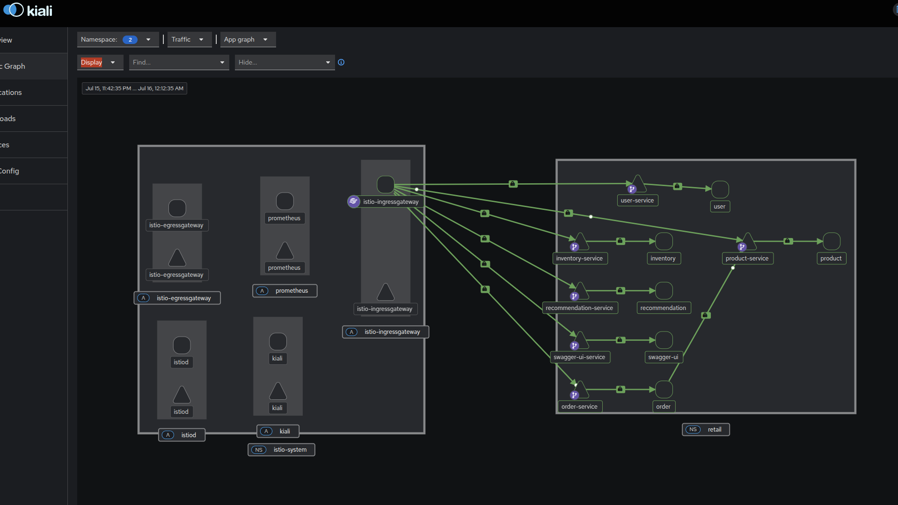

This file is a merged representation of the entire codebase, combined into a single document by Repomix.

# File Summary

## Purpose
This file contains a packed representation of the entire repository's contents.
It is designed to be easily consumable by AI systems for analysis, code review,
or other automated processes.

## File Format
The content is organized as follows:
1. This summary section
2. Repository information
3. Directory structure
4. Repository files (if enabled)
5. Multiple file entries, each consisting of:
  a. A header with the file path (## File: path/to/file)
  b. The full contents of the file in a code block

## Usage Guidelines
- This file should be treated as read-only. Any changes should be made to the
  original repository files, not this packed version.
- When processing this file, use the file path to distinguish
  between different files in the repository.
- Be aware that this file may contain sensitive information. Handle it with
  the same level of security as you would the original repository.

## Notes
- Some files may have been excluded based on .gitignore rules and Repomix's configuration
- Binary files are not included in this packed representation. Please refer to the Repository Structure section for a complete list of file paths, including binary files
- Files matching patterns in .gitignore are excluded
- Files matching default ignore patterns are excluded
- Files are sorted by Git change count (files with more changes are at the bottom)

# Directory Structure
```
autoscaling/
  inventory-hpa.yaml
  order-hpa.yaml
  product-hpa.yaml
  recommendations-hpa.yaml
  user-hpa.yaml
inventory-service/
  app.py
  Dockerfile
  requirements.txt
k8s-manifests/
  help.md
  ingress.yaml
  inventory-service.yaml
  istio-gateway.yaml
  istio-mtls-policy.yaml
  istio-virtualservice.yaml
  order-service.yaml
  product-service.yaml
  recommendation-service.yaml
  swagger-ingress.yaml
  swagger-ui-service.yaml
  user-service.yaml
order-service/
  app.py
  Dockerfile
  requirements.txt
product-service/
  app.py
  Dockerfile
  requirements.txt
recommendation-service/
  app.py
  Dockerfile
  requirements.txt
swagger-ui-service/
  app.py
  Dockerfile
  requirements.txt
user-service/
  app.py
  Dockerfile
  requirements.txt
.gitignore
build_n_push.sh
README.md
repomix-output.xml
```

# Files

## File: k8s-manifests/istio-gateway.yaml
````yaml
# k8s-manifests/istio-gateway.yaml
apiVersion: networking.istio.io/v1beta1
kind: Gateway
metadata:
  name: retail-gateway
  namespace: retail
spec:
  selector:
    # Use the default Istio Ingress Gateway
    istio: ingressgateway
  servers:
  - port:
      number: 80
      name: http
      protocol: http
    hosts:
    - "mariia.local"
````

## File: k8s-manifests/istio-mtls-policy.yaml
````yaml
apiVersion: security.istio.io/v1
kind: PeerAuthentication
metadata:
  name: "retail-peer-auth"
  namespace: "retail"
spec:
  mtls:
    mode: STRICT
````

## File: k8s-manifests/istio-virtualservice.yaml
````yaml
# k8s-manifests/istio-virtualservice.yaml
apiVersion: networking.istio.io/v1beta1
kind: VirtualService
metadata:
  name: retail-virtualservice
  namespace: retail
spec:
  hosts:
  - "mariia.local"
  gateways:
  - retail-gateway
  http:
  - match:
    - uri:
        prefix: "/product"
    rewrite:
      uri: "/"
    route:
    - destination:
        host: product-service.retail.svc.cluster.local
        port:
          number: 80
  - match:
    - uri:
        prefix: "/order"
    rewrite:
      uri: "/"
    route:
    - destination:
        host: order-service.retail.svc.cluster.local
        port:
          number: 80
  - match:
    - uri:
        prefix: "/inventory"
    rewrite:
      uri: "/"
    route:
    - destination:
        host: inventory-service.retail.svc.cluster.local
        port:
          number: 80
  - match:
    - uri:
        prefix: "/recommendation"
    rewrite:
      uri: "/"
    route:
    - destination:
        host: recommendation-service.retail.svc.cluster.local
        port:
          number: 80
  - match:
    - uri:
        prefix: "/user"
    rewrite:
      uri: "/"
    route:
    - destination:
        host: user-service.retail.svc.cluster.local
        port:
          number: 80
  - match:
    - uri:
        prefix: "/swagger"
    route:
    - destination:
        host: swagger-ui-service.retail.svc.cluster.local
        port:
          number: 80
````

## File: k8s-manifests/swagger-ingress.yaml
````yaml
# k8s-manifests/ingress.yaml

apiVersion: networking.k8s.io/v1
kind: Ingress
metadata:
  name: swagger-retail-ingress
  namespace: retail
  annotations:
    # Enable the rewrite engine
    nginx.ingress.kubernetes.io/use-regex: "true"
    # For each path, capture the part after the service prefix and use it as the new target.
    # The /$2 refers to the second capture group (.*) in the path regex.
    nginx.ingress.kubernetes.io/rewrite-target: /swagger/$2

spec:
  rules:
  - host: mariia.local
    http:
      paths:
      # The regex (.*) captures everything after /product/
      # The (/|$) handles requests for both /product and /product/
      - path: /swagger(/)(apispec.*)
        pathType: ImplementationSpecific
        backend:
          service:
            name: swagger-ui-service
            port:
              number: 80
      - path: /swagger(/|$)(apidocs/.*)
        pathType: ImplementationSpecific
        backend:
          service:
            name: swagger-ui-service
            port:
              number: 80
      - path: /swagger(/|$)(flasgger_static/.*)
        pathType: ImplementationSpecific
        backend:
          service:
            name: swagger-ui-service
            port:
              number: 80
````

## File: k8s-manifests/swagger-ui-service.yaml
````yaml
apiVersion: v1
kind: Service
metadata:
  name: swagger-ui-service
  namespace: retail
spec:
  selector:
    app: swagger-ui
  ports:
    - port: 80
      targetPort: 5006
---
apiVersion: apps/v1
kind: Deployment
metadata:
  name: swagger-ui-deployment
  namespace: retail
spec:
  replicas: 2
  selector:
    matchLabels:
      app: swagger-ui
  template:
    metadata:
      labels:
        app: swagger-ui
    spec:
      containers:
        - name: swagger-ui
          image: moira121/swagger-ui-service:latest
          ports:
            - containerPort: 5006
          readinessProbe:
            httpGet:
              path: /health
              port: 5006
            initialDelaySeconds: 15
            periodSeconds: 10
            failureThreshold: 5
````

## File: swagger-ui-service/app.py
````python
from flask import Flask, jsonify
from flasgger import Swagger

app = Flask(__name__)

swagger_template = {
    "swagger": "2.0",
    "info": {
        "title": "E-commerce Microservices API",
        "description": "API documentation for all e-commerce microservices.",
        "version": "1.0.0"
    },
    "host": "mariia.local",  # This should be your ingress host
    "basePath": "/",
    "schemes": [
        "http"
    ],
    "paths": {
        "/product/list": {
            "get": {
                "summary": "Get all products",
                "tags": ["Product"],
                "produces": ["application/json"],
                "responses": {
                    "200": {
                        "description": "A list of products."
                    }
                }
            }
        },
        "/product/{product_id}": {
            "get": {
                "summary": "Get a specific product",
                "tags": ["Product"],
                "produces": ["application/json"],
                "parameters": [
                    {
                        "name": "product_id",
                        "in": "path",
                        "required": True,
                        "type": "integer"
                    }
                ],
                "responses": {
                    "200": {
                        "description": "Product details."
                    },
                    "404": {
                        "description": "Product not found."
                    }
                }
            }
        },
        "/order/create": {
            "post": {
                "summary": "Create an order",
                "tags": ["Order"],
                "produces": ["application/json"],
                "consumes": ["application/json"],
                "parameters": [
                    {
                        "name": "body",
                        "in": "body",
                        "required": True,
                        "schema": {
                            "type": "object",
                            "properties": {
                                "product_id": {
                                    "type": "integer"
                                },
                                "quantity": {
                                    "type": "integer"
                                }
                            }
                        }
                    }
                ],
                "responses": {
                    "201": {
                        "description": "Order created."
                    },
                    "400": {
                        "description": "Invalid input."
                    }
                }
            }
        },
        "/user/list": {
            "get": {
                "summary": "Get all users",
                "tags": ["User"],
                "produces": ["application/json"],
                "responses": {
                    "200": {
                        "description": "A list of users."
                    }
                }
            }
        },
        "/user/{user_id}": {
            "get": {
                "summary": "Get a specific user",
                "tags": ["User"],
                "produces": ["application/json"],
                "parameters": [
                    {
                        "name": "user_id",
                        "in": "path",
                        "required": True,
                        "type": "integer"
                    }
                ],
                "responses": {
                    "200": {
                        "description": "User details."
                    },
                    "404": {
                        "description": "User not found."
                    }
                }
            }
        },
        "/inventory/list": {
            "get": {
                "summary": "List all inventory",
                "tags": ["Inventory"],
                "produces": ["application/json"],
                "responses": {
                    "200": {
                        "description": "A list of inventory stock."
                    }
                }
            }
        },
        "/inventory/{product_id}": {
            "get": {
                "summary": "Get stock for a product",
                "tags": ["Inventory"],
                "produces": ["application/json"],
                "parameters": [
                    {
                        "name": "product_id",
                        "in": "path",
                        "required": True,
                        "type": "integer"
                    }
                ],
                "responses": {
                    "200": {
                        "description": "Stock details."
                    }
                }
            }
        },
        "/recommendation/for-user/{user_id}": {
            "get": {
                "summary": "Get recommendations for a user",
                "tags": ["Recommendation"],
                "produces": ["application/json"],
                "parameters": [
                    {
                        "name": "user_id",
                        "in": "path",
                        "required": True,
                        "type": "string"
                    }
                ],
                "responses": {
                    "200": {
                        "description": "List of recommendations."
                    }
                }
            }
        }
    }
}

swagger_config = {
    "static_url_path": "/flasgger_static",  
    "url_prefix": "/swagger"
}

swagger = Swagger(app, template=swagger_template, config=swagger_config, merge=True)

@app.route('/health')
def health():
    return 'OK', 200

if __name__ == "__main__":
    app.run(host='0.0.0.0', port=5006)
````

## File: swagger-ui-service/Dockerfile
````
FROM python:3.8-slim-buster

WORKDIR /app

COPY requirements.txt requirements.txt
RUN pip3 install -r requirements.txt

COPY . .

CMD ["python3", "app.py"]
````

## File: swagger-ui-service/requirements.txt
````
Flask==3.0.2
gunicorn==20.1.0
requests==2.31.0
# flask-restx==1.3.0
flasgger==0.9.7.1
````

## File: autoscaling/inventory-hpa.yaml
````yaml
apiVersion: autoscaling/v2
kind: HorizontalPodAutoscaler
metadata:
  name: inventory-hpa
  namespace: retail
spec:
  scaleTargetRef:
    apiVersion: apps/v1
    kind: Deployment
    name: inventory-deployment
  minReplicas: 2
  maxReplicas: 12
  metrics:
  - type: Resource
    resource:
      name: cpu
      target:
        type: Utilization
        averageUtilization: 50
````

## File: autoscaling/order-hpa.yaml
````yaml
apiVersion: autoscaling/v2
kind: HorizontalPodAutoscaler
metadata:
  name: order-hpa
  namespace: retail
spec:
  scaleTargetRef:
    apiVersion: apps/v1
    kind: Deployment
    name: order-deployment
  minReplicas: 2
  maxReplicas: 12
  metrics:
  - type: Resource
    resource:
      name: cpu
      target:
        type: Utilization
        averageUtilization: 50
````

## File: autoscaling/product-hpa.yaml
````yaml
apiVersion: autoscaling/v2
kind: HorizontalPodAutoscaler
metadata:
  name: product-hpa
  namespace: retail
spec:
  scaleTargetRef:
    apiVersion: apps/v1
    kind: Deployment
    name: product-deployment
  minReplicas: 2
  maxReplicas: 12
  metrics:
  - type: Resource
    resource:
      name: cpu
      target:
        type: Utilization
        averageUtilization: 50
````

## File: autoscaling/recommendations-hpa.yaml
````yaml
apiVersion: autoscaling/v2
kind: HorizontalPodAutoscaler
metadata:
  name: recommentdations-hpa
  namespace: retail
spec:
  scaleTargetRef:
    apiVersion: apps/v1
    kind: Deployment
    name: recommendations-deployment
  minReplicas: 2
  maxReplicas: 13
  metrics:
  - type: Resource
    resource:
      name: cpu
      target:
        type: Utilization
        averageUtilization: 50
````

## File: autoscaling/user-hpa.yaml
````yaml
apiVersion: autoscaling/v2
kind: HorizontalPodAutoscaler
metadata:
  name: user-hpa
  namespace: retail
spec:
  scaleTargetRef:
    apiVersion: apps/v1
    kind: Deployment
    name: user-deployment
  minReplicas: 2
  maxReplicas: 12
  metrics:
  - type: Resource
    resource:
      name: cpu
      target:
        type: Utilization
        averageUtilization: 50
````

## File: inventory-service/Dockerfile
````
FROM python:3.8-slim-buster

WORKDIR /app

COPY requirements.txt requirements.txt
RUN pip3 install -r requirements.txt

COPY . .

#CMD [ "python3", "-m" , "flask", "run", "--host=0.0.0.0"]
CMD ["python3", "app.py"]
````

## File: k8s-manifests/inventory-service.yaml
````yaml
apiVersion: v1
kind: Service
metadata:
  name: inventory-service
  namespace: retail
spec:
  selector:
    app: inventory
  ports:
    - port: 80
      targetPort: 5005
---
apiVersion: apps/v1
kind: Deployment
metadata:
  name: inventory-deployment
  namespace: retail
spec:
  replicas: 2
  selector:
    matchLabels:
      app: inventory
  template:
    metadata:
      labels:
        app: inventory
    spec:
      containers:
        - name: inventory
          image: moira121/inventory-service:latest
          ports:
            - containerPort: 5005
          readinessProbe:
            httpGet:
              path: /health
              port: 5005
            initialDelaySeconds: 5
            periodSeconds: 10
````

## File: k8s-manifests/order-service.yaml
````yaml
apiVersion: v1
kind: Service
metadata:
  name: order-service
  namespace: retail
spec:
  selector:
    app: order
  ports:
    - port: 80
      targetPort: 5002
---
apiVersion: apps/v1
kind: Deployment
metadata:
  name: order-deployment
  namespace: retail
spec:
  replicas: 2
  selector:
    matchLabels:
      app: order
  template:
    metadata:
      labels:
        app: order
    spec:
      containers:
        - name: order
          image: moira121/order-service:latest
          ports:
            - containerPort: 5002
          readinessProbe:
            httpGet:
              path: /health
              port: 5002
            initialDelaySeconds: 5
            periodSeconds: 10
````

## File: k8s-manifests/product-service.yaml
````yaml
apiVersion: v1
kind: Service
metadata:
  name: product-service
  namespace: retail
spec:
  selector:
    app: product
  ports:
    - port: 80
      targetPort: 5001
---
apiVersion: apps/v1
kind: Deployment
metadata:
  name: product-deployment
  namespace: retail
spec:
  replicas: 2
  selector:
    matchLabels:
      app: product
  template:
    metadata:
      labels:
        app: product
    spec:
      containers:
      - name: product
        image: moira121/product-service:latest
        ports:
        - containerPort: 5001
        readinessProbe:
          httpGet:
            path: /health
            port: 5001
          initialDelaySeconds: 5
          periodSeconds: 10
````

## File: k8s-manifests/recommendation-service.yaml
````yaml
apiVersion: v1
kind: Service
metadata:
  name: recommendation-service
  namespace: retail
spec:
  selector:
    app: recommendation
  ports:
    - port: 80
      targetPort: 5003
---
apiVersion: apps/v1
kind: Deployment
metadata:
  name: recommendation-deployment
  namespace: retail
spec:
  replicas: 2
  selector:
    matchLabels:
      app: recommendation
  template:
    metadata:
      labels:
        app: recommendation
    spec:
      containers:
        - name: recommendation
          image: moira121/recommendation-service:latest
          ports:
            - containerPort: 5003
          readinessProbe:
            httpGet:
              path: /health
              port: 5003
            initialDelaySeconds: 5
            periodSeconds: 10
````

## File: k8s-manifests/user-service.yaml
````yaml
apiVersion: v1
kind: Service
metadata:
  name: user-service
  namespace: retail
spec:
  selector:
    app: user
  ports:
    - port: 80
      targetPort: 5004
---
apiVersion: apps/v1
kind: Deployment
metadata:
  name: user-deployment
  namespace: retail
spec:
  replicas: 2
  selector:
    matchLabels:
      app: user
  template:
    metadata:
      labels:
        app: user
    spec:
      containers:
        - name: user
          image: moira121/user-service:latest
          ports:
            - containerPort: 5004
          readinessProbe:
            httpGet:
              path: /health
              port: 5004
            initialDelaySeconds: 15
            periodSeconds: 10
            failureThreshold: 5
````

## File: order-service/Dockerfile
````
FROM python:3.8-slim-buster

WORKDIR /app

COPY requirements.txt requirements.txt
RUN pip3 install -r requirements.txt

COPY . .

CMD ["python3", "app.py"]
````

## File: product-service/Dockerfile
````
FROM python:3.8-slim-buster

WORKDIR /app

COPY requirements.txt requirements.txt
RUN pip3 install -r requirements.txt

COPY . .

CMD ["python3", "app.py"]
````

## File: recommendation-service/Dockerfile
````
FROM python:3.8-slim-buster

WORKDIR /app

COPY requirements.txt requirements.txt
RUN pip3 install -r requirements.txt

COPY . .

CMD ["python3", "app.py"]
````

## File: user-service/Dockerfile
````
FROM python:3.8-slim-buster

WORKDIR /app

COPY requirements.txt requirements.txt
RUN pip3 install -r requirements.txt

COPY . .

CMD ["python3", "app.py"]
````

## File: repomix-output.xml
````xml
<repomix><file_summary>This file is a merged representation of the entire codebase, combined into a single document by Repomix.
The content has been processed where content has been formatted for parsing in xml style.<purpose>This file contains a packed representation of the entire repository&apos;s contents.
It is designed to be easily consumable by AI systems for analysis, code review,
or other automated processes.</purpose><file_format>The content is organized as follows:
1. This summary section
2. Repository information
3. Directory structure
4. Repository files (if enabled)
5. Repository files, each consisting of:
  - File path as an attribute
  - Full contents of the file</file_format><usage_guidelines>- This file should be treated as read-only. Any changes should be made to the
  original repository files, not this packed version.
- When processing this file, use the file path to distinguish
  between different files in the repository.
- Be aware that this file may contain sensitive information. Handle it with
  the same level of security as you would the original repository.</usage_guidelines><notes>- Some files may have been excluded based on .gitignore rules and Repomix&apos;s configuration
- Binary files are not included in this packed representation. Please refer to the Repository Structure section for a complete list of file paths, including binary files
- Files matching patterns in .gitignore are excluded
- Files matching default ignore patterns are excluded
- Content has been formatted for parsing in xml style
- Files are sorted by Git change count (files with more changes are at the bottom)</notes></file_summary><directory_structure>autoscaling/
  inventory-hpa.yaml
  order-hpa.yaml
  product-hpa.yaml
  recommendations-hpa.yaml
  user-hpa.yaml
inventory-service/
  app.py
  Dockerfile
  requirements.txt
k8s-manifests/
  help.md
  ingress.yaml
  inventory-service.yaml
  istio-gateway.yaml
  istio-virtualservice.yaml
  mtls-policy.yaml
  order-service.yaml
  product-service.yaml
  recommendation-service.yaml
  swagger-ingress.yaml
  swagger-ui-service.yaml
  user-service.yaml
order-service/
  app.py
  Dockerfile
  requirements.txt
product-service/
  app.py
  Dockerfile
  requirements.txt
recommendation-service/
  app.py
  Dockerfile
  requirements.txt
swagger-ui-service/
  app.py
  Dockerfile
  requirements.txt
user-service/
  app.py
  Dockerfile
  requirements.txt
.gitignore
build_n_push.sh
README.md</directory_structure><files>This section contains the contents of the repository&apos;s files.<file path="k8s-manifests/istio-gateway.yaml"># k8s-manifests/istio-gateway.yaml
apiVersion: networking.istio.io/v1beta1
kind: Gateway
metadata:
  name: retail-gateway
  namespace: retail
spec:
  selector:
    # Use the default Istio Ingress Gateway
    istio: ingressgateway
  servers:
  - port:
      number: 80
      name: http
      protocol: HTTP
    hosts:
    # Listen for requests on our host
    - &quot;mariia.local&quot;</file><file path="k8s-manifests/istio-virtualservice.yaml"># k8s-manifests/istio-virtualservice.yaml
apiVersion: networking.istio.io/v1beta1
kind: VirtualService
metadata:
  name: retail-virtualservice
  namespace: retail
spec:
  hosts:
  - &quot;mariia.local&quot;
  gateways:
  - retail-gateway
  http:
  - match:
    - uri:
        prefix: &quot;/product&quot;
    rewrite:
      uri: &quot;/&quot;
    route:
    - destination:
        host: product-service.retail.svc.cluster.local
        port:
          number: 80
  - match:
    - uri:
        prefix: &quot;/order&quot;
    rewrite:
      uri: &quot;/&quot;
    route:
    - destination:
        host: order-service.retail.svc.cluster.local
        port:
          number: 80
  - match:
    - uri:
        prefix: &quot;/inventory&quot;
    rewrite:
      uri: &quot;/&quot;
    route:
    - destination:
        host: inventory-service.retail.svc.cluster.local
        port:
          number: 80
  - match:
    - uri:
        prefix: &quot;/recommendation&quot;
    rewrite:
      uri: &quot;/&quot;
    route:
    - destination:
        host: recommendation-service.retail.svc.cluster.local
        port:
          number: 80
  - match:
    - uri:
        prefix: &quot;/user&quot;
    rewrite:
      uri: &quot;/&quot;
    route:
    - destination:
        host: user-service.retail.svc.cluster.local
        port:
          number: 80
  - match:
    - uri:
        prefix: &quot;/swagger&quot;
    route:
    - destination:
        host: swagger-ui-service.retail.svc.cluster.local
        port:
          number: 80</file><file path="k8s-manifests/mtls-policy.yaml">apiVersion: security.istio.io/v1
kind: PeerAuthentication
metadata:
  name: &quot;default&quot;
  namespace: &quot;retail&quot;
spec:
  mtls:
    mode: STRICT</file><file path="k8s-manifests/swagger-ingress.yaml"># k8s-manifests/ingress.yaml

apiVersion: networking.k8s.io/v1
kind: Ingress
metadata:
  name: swagger-retail-ingress
  namespace: retail
  annotations:
    # Enable the rewrite engine
    nginx.ingress.kubernetes.io/use-regex: &quot;true&quot;
    # For each path, capture the part after the service prefix and use it as the new target.
    # The /$2 refers to the second capture group (.*) in the path regex.
    nginx.ingress.kubernetes.io/rewrite-target: /swagger/$2

spec:
  rules:
  - host: mariia.local
    http:
      paths:
      # The regex (.*) captures everything after /product/
      # The (/|$) handles requests for both /product and /product/
      - path: /swagger(/)(apispec.*)
        pathType: ImplementationSpecific
        backend:
          service:
            name: swagger-ui-service
            port:
              number: 80
      - path: /swagger(/|$)(apidocs/.*)
        pathType: ImplementationSpecific
        backend:
          service:
            name: swagger-ui-service
            port:
              number: 80
      - path: /swagger(/|$)(flasgger_static/.*)
        pathType: ImplementationSpecific
        backend:
          service:
            name: swagger-ui-service
            port:
              number: 80</file><file path="k8s-manifests/swagger-ui-service.yaml">apiVersion: v1
kind: Service
metadata:
  name: swagger-ui-service
  namespace: retail
spec:
  selector:
    app: swagger-ui
  ports:
    - port: 80
      targetPort: 5006
---
apiVersion: apps/v1
kind: Deployment
metadata:
  name: swagger-ui-deployment
  namespace: retail
spec:
  replicas: 2
  selector:
    matchLabels:
      app: swagger-ui
  template:
    metadata:
      labels:
        app: swagger-ui
    spec:
      containers:
        - name: swagger-ui
          image: moira121/swagger-ui-service:latest
          ports:
            - containerPort: 5006
          readinessProbe:
            httpGet:
              path: /health
              port: 5006
            initialDelaySeconds: 15
            periodSeconds: 10
            failureThreshold: 5</file><file path="swagger-ui-service/app.py">from flask import Flask, jsonify
from flasgger import Swagger

app = Flask(__name__)

swagger_template = {
    &quot;swagger&quot;: &quot;2.0&quot;,
    &quot;info&quot;: {
        &quot;title&quot;: &quot;E-commerce Microservices API&quot;,
        &quot;description&quot;: &quot;API documentation for all e-commerce microservices.&quot;,
        &quot;version&quot;: &quot;1.0.0&quot;
    },
    &quot;host&quot;: &quot;mariia.local&quot;,  # This should be your ingress host
    &quot;basePath&quot;: &quot;/&quot;,
    &quot;schemes&quot;: [
        &quot;http&quot;
    ],
    &quot;paths&quot;: {
        &quot;/product/list&quot;: {
            &quot;get&quot;: {
                &quot;summary&quot;: &quot;Get all products&quot;,
                &quot;tags&quot;: [&quot;Product&quot;],
                &quot;produces&quot;: [&quot;application/json&quot;],
                &quot;responses&quot;: {
                    &quot;200&quot;: {
                        &quot;description&quot;: &quot;A list of products.&quot;
                    }
                }
            }
        },
        &quot;/product/{product_id}&quot;: {
            &quot;get&quot;: {
                &quot;summary&quot;: &quot;Get a specific product&quot;,
                &quot;tags&quot;: [&quot;Product&quot;],
                &quot;produces&quot;: [&quot;application/json&quot;],
                &quot;parameters&quot;: [
                    {
                        &quot;name&quot;: &quot;product_id&quot;,
                        &quot;in&quot;: &quot;path&quot;,
                        &quot;required&quot;: True,
                        &quot;type&quot;: &quot;integer&quot;
                    }
                ],
                &quot;responses&quot;: {
                    &quot;200&quot;: {
                        &quot;description&quot;: &quot;Product details.&quot;
                    },
                    &quot;404&quot;: {
                        &quot;description&quot;: &quot;Product not found.&quot;
                    }
                }
            }
        },
        &quot;/order/create&quot;: {
            &quot;post&quot;: {
                &quot;summary&quot;: &quot;Create an order&quot;,
                &quot;tags&quot;: [&quot;Order&quot;],
                &quot;produces&quot;: [&quot;application/json&quot;],
                &quot;consumes&quot;: [&quot;application/json&quot;],
                &quot;parameters&quot;: [
                    {
                        &quot;name&quot;: &quot;body&quot;,
                        &quot;in&quot;: &quot;body&quot;,
                        &quot;required&quot;: True,
                        &quot;schema&quot;: {
                            &quot;type&quot;: &quot;object&quot;,
                            &quot;properties&quot;: {
                                &quot;product_id&quot;: {
                                    &quot;type&quot;: &quot;integer&quot;
                                },
                                &quot;quantity&quot;: {
                                    &quot;type&quot;: &quot;integer&quot;
                                }
                            }
                        }
                    }
                ],
                &quot;responses&quot;: {
                    &quot;201&quot;: {
                        &quot;description&quot;: &quot;Order created.&quot;
                    },
                    &quot;400&quot;: {
                        &quot;description&quot;: &quot;Invalid input.&quot;
                    }
                }
            }
        },
        &quot;/user/list&quot;: {
            &quot;get&quot;: {
                &quot;summary&quot;: &quot;Get all users&quot;,
                &quot;tags&quot;: [&quot;User&quot;],
                &quot;produces&quot;: [&quot;application/json&quot;],
                &quot;responses&quot;: {
                    &quot;200&quot;: {
                        &quot;description&quot;: &quot;A list of users.&quot;
                    }
                }
            }
        },
        &quot;/user/{user_id}&quot;: {
            &quot;get&quot;: {
                &quot;summary&quot;: &quot;Get a specific user&quot;,
                &quot;tags&quot;: [&quot;User&quot;],
                &quot;produces&quot;: [&quot;application/json&quot;],
                &quot;parameters&quot;: [
                    {
                        &quot;name&quot;: &quot;user_id&quot;,
                        &quot;in&quot;: &quot;path&quot;,
                        &quot;required&quot;: True,
                        &quot;type&quot;: &quot;integer&quot;
                    }
                ],
                &quot;responses&quot;: {
                    &quot;200&quot;: {
                        &quot;description&quot;: &quot;User details.&quot;
                    },
                    &quot;404&quot;: {
                        &quot;description&quot;: &quot;User not found.&quot;
                    }
                }
            }
        },
        &quot;/inventory/list&quot;: {
            &quot;get&quot;: {
                &quot;summary&quot;: &quot;List all inventory&quot;,
                &quot;tags&quot;: [&quot;Inventory&quot;],
                &quot;produces&quot;: [&quot;application/json&quot;],
                &quot;responses&quot;: {
                    &quot;200&quot;: {
                        &quot;description&quot;: &quot;A list of inventory stock.&quot;
                    }
                }
            }
        },
        &quot;/inventory/{product_id}&quot;: {
            &quot;get&quot;: {
                &quot;summary&quot;: &quot;Get stock for a product&quot;,
                &quot;tags&quot;: [&quot;Inventory&quot;],
                &quot;produces&quot;: [&quot;application/json&quot;],
                &quot;parameters&quot;: [
                    {
                        &quot;name&quot;: &quot;product_id&quot;,
                        &quot;in&quot;: &quot;path&quot;,
                        &quot;required&quot;: True,
                        &quot;type&quot;: &quot;integer&quot;
                    }
                ],
                &quot;responses&quot;: {
                    &quot;200&quot;: {
                        &quot;description&quot;: &quot;Stock details.&quot;
                    }
                }
            }
        },
        &quot;/recommendation/for-user/{user_id}&quot;: {
            &quot;get&quot;: {
                &quot;summary&quot;: &quot;Get recommendations for a user&quot;,
                &quot;tags&quot;: [&quot;Recommendation&quot;],
                &quot;produces&quot;: [&quot;application/json&quot;],
                &quot;parameters&quot;: [
                    {
                        &quot;name&quot;: &quot;user_id&quot;,
                        &quot;in&quot;: &quot;path&quot;,
                        &quot;required&quot;: True,
                        &quot;type&quot;: &quot;string&quot;
                    }
                ],
                &quot;responses&quot;: {
                    &quot;200&quot;: {
                        &quot;description&quot;: &quot;List of recommendations.&quot;
                    }
                }
            }
        }
    }
}

swagger_config = {
    &quot;static_url_path&quot;: &quot;/flasgger_static&quot;,  
    &quot;url_prefix&quot;: &quot;/swagger&quot;
}

swagger = Swagger(app, template=swagger_template, config=swagger_config, merge=True)

@app.route(&apos;/health&apos;)
def health():
    return &apos;OK&apos;, 200

if __name__ == &quot;__main__&quot;:
    app.run(host=&apos;0.0.0.0&apos;, port=5006)</file><file path="swagger-ui-service/Dockerfile">FROM python:3.8-slim-buster

WORKDIR /app

COPY requirements.txt requirements.txt
RUN pip3 install -r requirements.txt

COPY . .

CMD [&quot;python3&quot;, &quot;app.py&quot;]</file><file path="swagger-ui-service/requirements.txt">Flask==3.0.2
gunicorn==20.1.0
requests==2.31.0
# flask-restx==1.3.0
flasgger==0.9.7.1</file><file path="autoscaling/inventory-hpa.yaml">apiVersion: autoscaling/v2
kind: HorizontalPodAutoscaler
metadata:
  name: inventory-hpa
  namespace: retail
spec:
  scaleTargetRef:
    apiVersion: apps/v1
    kind: Deployment
    name: inventory-deployment
  minReplicas: 2
  maxReplicas: 12
  metrics:
  - type: Resource
    resource:
      name: cpu
      target:
        type: Utilization
        averageUtilization: 50</file><file path="autoscaling/order-hpa.yaml">apiVersion: autoscaling/v2
kind: HorizontalPodAutoscaler
metadata:
  name: order-hpa
  namespace: retail
spec:
  scaleTargetRef:
    apiVersion: apps/v1
    kind: Deployment
    name: order-deployment
  minReplicas: 2
  maxReplicas: 12
  metrics:
  - type: Resource
    resource:
      name: cpu
      target:
        type: Utilization
        averageUtilization: 50</file><file path="autoscaling/product-hpa.yaml">apiVersion: autoscaling/v2
kind: HorizontalPodAutoscaler
metadata:
  name: product-hpa
  namespace: retail
spec:
  scaleTargetRef:
    apiVersion: apps/v1
    kind: Deployment
    name: product-deployment
  minReplicas: 2
  maxReplicas: 12
  metrics:
  - type: Resource
    resource:
      name: cpu
      target:
        type: Utilization
        averageUtilization: 50</file><file path="autoscaling/recommendations-hpa.yaml">apiVersion: autoscaling/v2
kind: HorizontalPodAutoscaler
metadata:
  name: recommentdations-hpa
  namespace: retail
spec:
  scaleTargetRef:
    apiVersion: apps/v1
    kind: Deployment
    name: recommendations-deployment
  minReplicas: 2
  maxReplicas: 13
  metrics:
  - type: Resource
    resource:
      name: cpu
      target:
        type: Utilization
        averageUtilization: 50</file><file path="autoscaling/user-hpa.yaml">apiVersion: autoscaling/v2
kind: HorizontalPodAutoscaler
metadata:
  name: user-hpa
  namespace: retail
spec:
  scaleTargetRef:
    apiVersion: apps/v1
    kind: Deployment
    name: user-deployment
  minReplicas: 2
  maxReplicas: 12
  metrics:
  - type: Resource
    resource:
      name: cpu
      target:
        type: Utilization
        averageUtilization: 50</file><file path="inventory-service/Dockerfile">FROM python:3.8-slim-buster

WORKDIR /app

COPY requirements.txt requirements.txt
RUN pip3 install -r requirements.txt

COPY . .

#CMD [ &quot;python3&quot;, &quot;-m&quot; , &quot;flask&quot;, &quot;run&quot;, &quot;--host=0.0.0.0&quot;]
CMD [&quot;python3&quot;, &quot;app.py&quot;]</file><file path="k8s-manifests/inventory-service.yaml">apiVersion: v1
kind: Service
metadata:
  name: inventory-service
  namespace: retail
spec:
  selector:
    app: inventory
  ports:
    - port: 80
      targetPort: 5005
---
apiVersion: apps/v1
kind: Deployment
metadata:
  name: inventory-deployment
  namespace: retail
spec:
  replicas: 2
  selector:
    matchLabels:
      app: inventory
  template:
    metadata:
      labels:
        app: inventory
    spec:
      containers:
        - name: inventory
          image: moira121/inventory-service:latest
          ports:
            - containerPort: 5005
          readinessProbe:
            httpGet:
              path: /health
              port: 5005
            initialDelaySeconds: 5
            periodSeconds: 10</file><file path="k8s-manifests/order-service.yaml">apiVersion: v1
kind: Service
metadata:
  name: order-service
  namespace: retail
spec:
  selector:
    app: order
  ports:
    - port: 80
      targetPort: 5002
---
apiVersion: apps/v1
kind: Deployment
metadata:
  name: order-deployment
  namespace: retail
spec:
  replicas: 2
  selector:
    matchLabels:
      app: order
  template:
    metadata:
      labels:
        app: order
    spec:
      containers:
        - name: order
          image: moira121/order-service:latest
          ports:
            - containerPort: 5002
          readinessProbe:
            httpGet:
              path: /health
              port: 5002
            initialDelaySeconds: 5
            periodSeconds: 10</file><file path="k8s-manifests/product-service.yaml">apiVersion: v1
kind: Service
metadata:
  name: product-service
  namespace: retail
spec:
  selector:
    app: product
  ports:
    - port: 80
      targetPort: 5001
---
apiVersion: apps/v1
kind: Deployment
metadata:
  name: product-deployment
  namespace: retail
spec:
  replicas: 2
  selector:
    matchLabels:
      app: product
  template:
    metadata:
      labels:
        app: product
    spec:
      containers:
      - name: product
        image: moira121/product-service:latest
        ports:
        - containerPort: 5001
        readinessProbe:
          httpGet:
            path: /health
            port: 5001
          initialDelaySeconds: 5
          periodSeconds: 10</file><file path="k8s-manifests/recommendation-service.yaml">apiVersion: v1
kind: Service
metadata:
  name: recommendation-service
  namespace: retail
spec:
  selector:
    app: recommendation
  ports:
    - port: 80
      targetPort: 5003
---
apiVersion: apps/v1
kind: Deployment
metadata:
  name: recommendation-deployment
  namespace: retail
spec:
  replicas: 2
  selector:
    matchLabels:
      app: recommendation
  template:
    metadata:
      labels:
        app: recommendation
    spec:
      containers:
        - name: recommendation
          image: moira121/recommendation-service:latest
          ports:
            - containerPort: 5003
          readinessProbe:
            httpGet:
              path: /health
              port: 5003
            initialDelaySeconds: 5
            periodSeconds: 10</file><file path="k8s-manifests/user-service.yaml">apiVersion: v1
kind: Service
metadata:
  name: user-service
  namespace: retail
spec:
  selector:
    app: user
  ports:
    - port: 80
      targetPort: 5004
---
apiVersion: apps/v1
kind: Deployment
metadata:
  name: user-deployment
  namespace: retail
spec:
  replicas: 2
  selector:
    matchLabels:
      app: user
  template:
    metadata:
      labels:
        app: user
    spec:
      containers:
        - name: user
          image: moira121/user-service:latest
          ports:
            - containerPort: 5004
          readinessProbe:
            httpGet:
              path: /health
              port: 5004
            initialDelaySeconds: 15
            periodSeconds: 10
            failureThreshold: 5</file><file path="order-service/Dockerfile">FROM python:3.8-slim-buster

WORKDIR /app

COPY requirements.txt requirements.txt
RUN pip3 install -r requirements.txt

COPY . .

CMD [&quot;python3&quot;, &quot;app.py&quot;]</file><file path="product-service/Dockerfile">FROM python:3.8-slim-buster

WORKDIR /app

COPY requirements.txt requirements.txt
RUN pip3 install -r requirements.txt

COPY . .

CMD [&quot;python3&quot;, &quot;app.py&quot;]</file><file path="recommendation-service/Dockerfile">FROM python:3.8-slim-buster

WORKDIR /app

COPY requirements.txt requirements.txt
RUN pip3 install -r requirements.txt

COPY . .

CMD [&quot;python3&quot;, &quot;app.py&quot;]</file><file path="user-service/Dockerfile">FROM python:3.8-slim-buster

WORKDIR /app

COPY requirements.txt requirements.txt
RUN pip3 install -r requirements.txt

COPY . .

CMD [&quot;python3&quot;, &quot;app.py&quot;]</file><file path="k8s-manifests/help.md">kubectl create namespace retail
minikube addons enable ingress
minikube ip

for redeploy images

# Restart a specific deployment
kubectl rollout restart deployment/product-deployment -n retail

# Or, restart all deployments in your namespace at once
kubectl rollout restart deployment -n retail

istio:
curl -L https://istio.io/downloadIstio | sh -
cd istio-*
export PATH=$PWD/bin:$PATH

istioctl install --set profile=demo -y

minikube kubectl -- label namespace retail istio-injection=enabled

to check mtls:

istioctl ps (all should be SYNCED)

find istio ingress IP
      
minikube service istio-ingressgateway -n istio-system --url

istioctl analyze -n retail</file><file path=".gitignore">__pycache__/
.env
venv/</file><file path="build_n_push.sh">#!/bin/bash
alias kubectl=&quot;minikube kubectl --&quot;

docker build -t moira121/swagger-ui-service:latest ./swagger-ui-service
docker build -t moira121/recommendation-service:latest ./recommendation-service
docker build -t moira121/user-service:latest ./user-service
docker build -t moira121/inventory-service:latest ./inventory-service
docker build -t moira121/order-service:latest ./order-service
docker build -t moira121/product-service:latest ./product-service

docker push moira121/recommendation-service:latest
docker push moira121/user-service:latest
docker push moira121/product-service:latest
docker push moira121/order-service:latest
docker push moira121/inventory-service:latest
docker push moira121/swagger-ui-service:latest

# minikube kubectl -- apply -f k8s-manifests/ingress.yaml
# minikube kubectl -- apply -f k8s-manifests/swagger-ingress.yaml

echo &quot;--- Cleaning up old Ingress resources ---&quot;
minikube kubectl -- delete ingress retail-ingress -n retail --ignore-not-found
minikube kubectl -- delete ingress swagger-retail-ingress -n retail --ignore-not-found

echo &quot;--- Applying Kubernetes &amp; Istio Manifests ---&quot;
minikube kubectl -- apply -f k8s-manifests/istio-gateway.yaml
minikube kubectl -- apply -f k8s-manifests/istio-virtualservice.yaml

# Apply the mTLS policy
minikube kubectl -- apply -f k8s-manifests/mtls-policy.yaml

minikube kubectl -- apply -f k8s-manifests/swagger-ui-service.yaml
minikube kubectl -- apply -f k8s-manifests/recommendation-service.yaml
minikube kubectl -- apply -f k8s-manifests/order-service.yaml
minikube kubectl -- apply -f k8s-manifests/user-service.yaml
minikube kubectl -- apply -f k8s-manifests/inventory-service.yaml
minikube kubectl -- apply -f k8s-manifests/product-service.yaml

minikube kubectl -- rollout restart deployment -n retail

minikube kubectl -- get pods -n retail</file><file path="README.md"># Retail Store Microservices Application

## Overview
A cloud-native e-commerce platform built with 5 containerized microservices, orchestrated using Kubernetes. Demonstrates modern DevOps practices including CI/CD readiness, horizontal autoscaling, and centralized configuration.

## Architecture
### Microservices
| Service           | Tech Stack      | Port | Description                          | Docker Image                     |
|-------------------|----------------|------|--------------------------------------|----------------------------------|
| Product           | Python/Flask   | 5001 | Product catalog management           | yourprofilename/product-service:latest   |
| Order             | Python/Flask   | 5002 | Order processing system              | yourprofilename/order-service:latest     |
| User              | Python/Flask   | 5003 | Customer account management          | yourprofilename/user-service:latest      |
| Inventory         | Python/Flask   | 5005 | Real-time stock tracking             | yourprofilename/inventory-service:latest |
| Recommendation    | Python/Flask   | 5003 | Personalized suggestions             | yourprofilename/recommendation-service:latest |

### Kubernetes Components
- **Ingress**: Routes traffic to services via `mariia.local`
- **Horizontal Pod Autoscaler**: Auto-scales Product and Order services
- **Health Checks**: Readiness probes on `/health` endpoint
- **Service Discovery**: Internal DNS-based communication

## Prerequisites
- Docker 20.10+
- Kubernetes cluster (Minikube v1.25+ or cloud provider)
- `kubectl` 1.24+
- `minikube` with ingress addon enabled (`minikube addons enable ingress`)
- Python 3.9+ (for Flask services)

## Deployment
### 1. Build and Push Images
For each service (e.g., `product-service`):
```bash
docker build -t yourprofilename/product-service:latest ./product-service
docker push yourprofilename/product-service:latest
# Repeat for other services
```

### 2. Apply Kubernetes Manifests
```bash
kubectl apply -f product-service.yaml
kubectl apply -f order-service.yaml
kubectl apply -f user-service.yaml
kubectl apply -f inventory-service.yaml
kubectl apply -f recommendation-service.yaml
kubectl apply -f ingress.yaml
kubectl apply -f product-hpa.yaml
kubectl apply -f order-hpa.yaml
```

### 3. Verify Deployment
```bash
kubectl get all -n retail
kubectl get ingress -n retail
```

## API Endpoints
| Service       | Path               | Method | Description                  |
|---------------|--------------------|--------|------------------------------|
| Product       | /product           | GET    | Get product catalog          |
| Product       | /product/{id}           | GET    | Get product by id          |
| Order         | /order             | POST   | Create new order             |
| User          | /user/{id}         | GET    | Get user details             |
| Inventory     | /inventory/{id}    | GET    | Check product stock          |
| Recommendation| /recommendation/{id}    | GET    | Get product recommendations  |

## API Documentation (Swagger)

Each service provides OpenAPI documentation via Swagger UI. Once deployed, the documentation is accessible through the Ingress:

- Product Service: http://mariia.local/product/docs/
- Order Service: http://mariia.local/order/docs/
- User Service: http://mariia.local/user/docs/
- Inventory Service: http://mariia.local/inventory/docs/
- Recommendation Service: http://mariia.local/recommendation/docs/

## Health Checks
All services expose a health endpoint:
```bash
curl http://mariia.local/order/health
```

## Troubleshooting
1. **CrashLoopBackOff**:
   ```bash
   kubectl logs &lt;pod-name&gt; -n retail --previous
   ```

2. **Ingress 404 Errors**:
   - Verify hostname resolution
   - Check rewrite-target annotation

3. **HPA Not Scaling**:
   ```bash
   kubectl describe hpa -n retail
   kubectl top pods -n retail
   ```

**Note**: For local development, add to your `/etc/hosts`:
```
&lt;minikube-ip&gt; mariia.local
```</file><file path="inventory-service/requirements.txt">Flask==3.0.2
gunicorn==20.1.0
requests==2.31.0
# flask-restx==1.3.0
flasgger==0.9.7.1</file><file path="k8s-manifests/ingress.yaml"># k8s-manifests/ingress.yaml

apiVersion: networking.k8s.io/v1
kind: Ingress
metadata:
  name: retail-ingress
  namespace: retail
  annotations:
    # Enable the rewrite engine
    nginx.ingress.kubernetes.io/use-regex: &quot;true&quot;
    # For each path, capture the part after the service prefix and use it as the new target.
    # The /$2 refers to the second capture group (.*) in the path regex.
    nginx.ingress.kubernetes.io/rewrite-target: /$2

spec:
  rules:
  - host: mariia.local
    http:
      paths:
      # The regex (.*) captures everything after /product/
      # The (/|$) handles requests for both /product and /product/
      - path: /product(/|$)(.*)
        pathType: ImplementationSpecific
        backend:
          service:
            name: product-service
            port:
              number: 80
      - path: /order(/|$)(.*)
        pathType: ImplementationSpecific
        backend:
          service:
            name: order-service
            port:
              number: 80
      - path: /inventory(/|$)(.*)
        pathType: ImplementationSpecific
        backend:
          service:
            name: inventory-service
            port:
              number: 80
      - path: /recommendation(/|$)(.*)
        pathType: ImplementationSpecific
        backend:
          service:
            name: recommendation-service
            port:
              number: 80
      - path: /user(/|$)(.*)
        pathType: ImplementationSpecific
        backend:
          service:
            name: user-service
            port:
              number: 80</file><file path="order-service/requirements.txt">Flask==2.3.2
gunicorn==20.1.0
requests==2.31.0
# flask-restx==1.3.0
flasgger==0.9.7.1</file><file path="product-service/requirements.txt">Flask==3.0.2
gunicorn==20.1.0
requests==2.31.0
# flask-restx==1.3.0
flasgger==0.9.7.1</file><file path="recommendation-service/requirements.txt">Flask==2.3.2
gunicorn==20.1.0
requests==2.31.0
# flask-restx==1.3.0
flasgger==0.9.7.1</file><file path="user-service/requirements.txt">Flask==3.0.2
gunicorn==20.1.0
requests==2.31.0
# flask-restx==1.3.0
flasgger==0.9.7.1</file><file path="inventory-service/app.py">from flask import Flask, jsonify

app = Flask(__name__)

stock_db = [
    {&quot;id&quot;: 1, &quot;stock&quot;: 50},
    {&quot;id&quot;: 2, &quot;stock&quot;: 200}
]

@app.route(&apos;/list&apos;, methods=[&apos;GET&apos;])
def list_stock():
    &quot;&quot;&quot;
    List inventory
    ---
    tags:
      - Inventory Operations
    responses:
      200:
        description: A list of stock levels
        schema:
          type: array
          items:
            $ref: &apos;#/definitions/StockLevel&apos;
    &quot;&quot;&quot;
    return jsonify(stock_db)

@app.route(&apos;/&lt;int:product_id&gt;&apos;, methods=[&apos;GET&apos;])
def get_stock_level(product_id):
    &quot;&quot;&quot;
    Get the current stock level for a product
    ---
    tags:
      - Inventory Operations
    parameters:
      - name: product_id
        in: path
        type: integer
        required: true
        description: The product identifier
    responses:
      200:
        description: The current stock level
        schema:
          $ref: &apos;#/definitions/StockLevel&apos;
    definitions:
      StockLevel:
        type: object
        properties:
          id:
            type: integer
            description: The product unique identifier
          stock:
            type: integer
            description: Available stock quantity
    &quot;&quot;&quot;
    product = next((p for p in stock_db if p[&quot;id&quot;] == product_id), None)
    quantity = product[&quot;stock&quot;] if product else 0
    return jsonify({&quot;product_id&quot;: product_id, &quot;stock&quot;: quantity})

@app.route(&apos;/health&apos;)
def health():
    return &apos;OK&apos;, 200

if __name__ == &apos;__main__&apos;:
    app.run(host=&apos;0.0.0.0&apos;, port=5005)</file><file path="order-service/app.py">from flask import Flask, request, jsonify

app = Flask(__name__)

@app.route(&apos;/create&apos;, methods=[&apos;POST&apos;])
def create_order():
    &quot;&quot;&quot;
    Create a new order
    ---
    tags:
      - Order Operations
    parameters:
      - in: body
        name: body
        required: true
        schema:
          id: OrderRequest
          required:
            - product_id
          properties:
            product_id:
              type: integer
              description: ID of the product to order
            quantity:
              type: integer
              description: Quantity to order
              default: 1
    responses:
      201:
        description: Order created successfully
        schema:
          id: OrderResponse
          properties:
            message:
              type: string
              description: Status message
            product:
              $ref: &apos;#/definitions/ProductInfo&apos;
      404:
        description: Product not found
      500:
        description: Internal Server Error
    definitions:
      ProductInfo:
        type: object
        properties:
          id:
            type: integer
          name:
            type: string
          price:
            type: number
            format: float
    &quot;&quot;&quot;
    data = request.get_json()
    product_id = data.get(&apos;product_id&apos;)

    try:
        product_response = requests.get(f&quot;http://product-service/{product_id}&quot;)
        product_response.raise_for_status()
        product_data = product_response.json()
    except requests.exceptions.HTTPError as e:
        if e.response.status_code == 404:
            return jsonify({&quot;error&quot;: f&quot;Product ID {product_id} not found in Product Service.&quot;}), 404
        else:
            return jsonify({&quot;error&quot;: f&quot;Error from Product Service: {e}&quot;}), 500
    except Exception as e:
        return jsonify({&quot;error&quot;: f&quot;Could not connect to Product Service: {e}&quot;}), 500

    return jsonify({
        &apos;message&apos;: &apos;Order created&apos;,
        &apos;product&apos;: product_data
    }), 201

@app.route(&apos;/health&apos;)
def health():
    return &apos;OK&apos;, 200

if __name__ == &apos;__main__&apos;:
    app.run(host=&apos;0.0.0.0&apos;, port=5002)</file><file path="product-service/app.py">from flask import Flask, jsonify

app = Flask(__name__)

products_db = [
    {&quot;id&quot;: 1, &quot;name&quot;: &quot;Laptop&quot;, &quot;price&quot;: 350.25},
    {&quot;id&quot;: 2, &quot;name&quot;: &quot;Smartphone&quot;, &quot;price&quot;: 400.00},
    {&quot;id&quot;: 3, &quot;name&quot;: &quot;Headphones&quot;, &quot;price&quot;: 149.99}
]

@app.route(&apos;/list&apos;, methods=[&apos;GET&apos;])
def list_products():
    &quot;&quot;&quot;
    List all products
    ---
    tags:
      - Product Operations
    responses:
      200:
        description: A list of products
        schema:
          type: array
          items:
            $ref: &apos;#/definitions/Product&apos;
    &quot;&quot;&quot;
    return jsonify(products_db)

@app.route(&apos;/&lt;int:product_id&gt;&apos;, methods=[&apos;GET&apos;])
def get_product(product_id):
    &quot;&quot;&quot;
    Fetch a product given its identifier
    ---
    tags:
      - Product Operations
    parameters:
      - name: product_id
        in: path
        type: integer
        required: true
        description: The product identifier
    responses:
      200:
        description: The requested product
        schema:
          $ref: &apos;#/definitions/Product&apos;
      404:
        description: Product not found
    definitions:
      Product:
        type: object
        properties:
          id:
            type: integer
            description: The product unique identifier
          name:
            type: string
            description: The product name
          price:
            type: number
            format: float
            description: The product price
    &quot;&quot;&quot;
    product = next((p for p in products_db if p[&quot;id&quot;] == product_id), None)
    if product:
        return jsonify(product)
    return jsonify({&quot;error&quot;: f&quot;Product {product_id} not found&quot;}), 404

@app.route(&apos;/health&apos;)
def health():
    return &apos;OK&apos;, 200

if __name__ == &apos;__main__&apos;:
    app.run(host=&apos;0.0.0.0&apos;, port=5001)</file><file path="recommendation-service/app.py">from flask import Flask, jsonify

app = Flask(__name__)

@app.route(&apos;/for-user/&lt;string:user_id&gt;&apos;, methods=[&apos;GET&apos;])
def get_recommendations(user_id):
    &quot;&quot;&quot;
    Get recommendations for a specific user
    ---
    tags:
      - Recommendation Operations
    parameters:
      - name: user_id
        in: path
        type: string
        required: true
        description: The user identifier
    responses:
      200:
        description: A list of recommendations for the user
        schema:
          id: Recommendation
          properties:
            user_id:
              type: string
              description: The user identifier
            recommendations:
              type: array
              items:
                type: string
              description: List of recommended product IDs
    &quot;&quot;&quot;
    # Dummy recommendations
    return jsonify({&quot;user_id&quot;: user_id, &quot;recommendations&quot;: [&quot;1&quot;, &quot;2&quot;]})

@app.route(&apos;/health&apos;)
def health():
    return &apos;OK&apos;, 200

if __name__ == &apos;__main__&apos;:
    app.run(host=&apos;0.0.0.0&apos;, port=5003)</file><file path="user-service/app.py">from flask import Flask, jsonify

app = Flask(__name__)

# In-memory data store
users_db = [
    {&quot;id&quot;: 1, &quot;name&quot;: &quot;Alice&quot;, &quot;email&quot;: &quot;alice@example.com&quot;},
    {&quot;id&quot;: 2, &quot;name&quot;: &quot;Bob&quot;, &quot;email&quot;: &quot;bob@example.com&quot;}
]

@app.route(&apos;/list&apos;, methods=[&apos;GET&apos;])
def list_users():
    &quot;&quot;&quot;
    List all users
    ---
    tags:
      - User Operations
    responses:
      200:
        description: A list of users
        schema:
          type: array
          items:
            $ref: &apos;#/definitions/User&apos;
    &quot;&quot;&quot;
    return jsonify(users_db)

@app.route(&apos;/&lt;int:user_id&gt;&apos;, methods=[&apos;GET&apos;])
def get_user(user_id):
    &quot;&quot;&quot;
    Fetch a user given their identifier
    ---
    tags:
      - User Operations
    parameters:
      - name: user_id
        in: path
        type: integer
        required: true
        description: The user identifier
    responses:
      200:
        description: The requested user
        schema:
          $ref: &apos;#/definitions/User&apos;
      404:
        description: User not found
    definitions:
      User:
        type: object
        properties:
          id:
            type: integer
            description: The user unique identifier
          name:
            type: string
            description: The user name
          email:
            type: string
            description: The user email
    &quot;&quot;&quot;
    user = next((user for user in users_db if user[&quot;id&quot;] == user_id), None)
    if user:
        return jsonify(user)
    return jsonify({&quot;error&quot;: f&quot;User {user_id} not found&quot;}), 404

@app.route(&apos;/health&apos;)
def health():
    return &apos;OK&apos;, 200

if __name__ == &apos;__main__&apos;:
    app.run(host=&apos;0.0.0.0&apos;, port=5004)</file></files></repomix>
````

## File: k8s-manifests/help.md
````markdown
kubectl create namespace retail
minikube addons enable ingress
minikube ip

for redeploy images

# Restart a specific deployment
kubectl rollout restart deployment/product-deployment -n retail

# Or, restart all deployments in your namespace at once
kubectl rollout restart deployment -n retail

istio:

https://freedium.cfd/https://harsh05.medium.com/understanding-istio-security-peer-authentication-and-mtls-for-microservices-d1fd1ef60d55
https://minimaldevops.com/mastering-mtls-in-kubernetes-25a762b58d90

curl -L https://istio.io/downloadIstio | sh -
cd istio-*
export PATH=$PWD/bin:$PATH

istioctl install --set profile=demo -y

# enable istio injection in containers
minikube kubectl -- label namespace retail istio-injection=enabled

# add some test services
minikube kubectl -- apply -f https://raw.githubusercontent.com/istio/istio/release-1.26/samples/httpbin/httpbin.yaml -n retail
minikube kubectl -- apply -f https://raw.githubusercontent.com/istio/istio/release-1.26/samples/curl/curl.yaml -n retail

# test services could connect each other
for from in "retail"; do for to in "retail"; do minikube kubectl -- exec "$(minikube kubectl -- get pod -l app=curl -n ${from} -o jsonpath={.items..metadata.name})" -c curl -n ${from} -- curl http://httpbin.${to}:8000/ip -s -o /dev/null -w "curl.${from} to httpbin.${to}: %{http_code}\n"; done; done

minikube kubectl -- get peerauthentication --all-namespaces #check peer auth in cluster

# Create and apply a PeerAuthentication policy to enforce mTLS on retiail namespace
minikube kubectl -- apply -f k8s-manifests/istio-mtls-policy.yaml

istio dashboard kiali
kubectl apply -f https://raw.githubusercontent.com/istio/istio/release-1.26/samples/addons/kiali.yaml
expose kiali
minikube kubectl -- port-forward svc/kiali 20001:20001 -n istio-system
to check mtls:

istioctl ps (all should be SYNCED)

find istio ingress IP
      
minikube service istio-ingressgateway -n istio-system --url

istioctl analyze -n retail
````

## File: .gitignore
````
__pycache__/
.env
venv/
````

## File: build_n_push.sh
````bash
#!/bin/bash
alias kubectl="minikube kubectl --"

# docker build -t moira121/swagger-ui-service:latest ./swagger-ui-service
# docker build -t moira121/recommendation-service:latest ./recommendation-service
# docker build -t moira121/user-service:latest ./user-service
# docker build -t moira121/inventory-service:latest ./inventory-service
# docker build -t moira121/order-service:latest ./order-service
# docker build -t moira121/product-service:latest ./product-service

# docker push moira121/recommendation-service:latest
# docker push moira121/user-service:latest
# docker push moira121/product-service:latest
# docker push moira121/order-service:latest
# docker push moira121/inventory-service:latest
# docker push moira121/swagger-ui-service:latest

# minikube kubectl -- apply -f k8s-manifests/ingress.yaml
# minikube kubectl -- apply -f k8s-manifests/swagger-ingress.yaml

echo "--- Cleaning up old Ingress resources ---"
minikube kubectl -- delete ingress retail-ingress -n retail --ignore-not-found
minikube kubectl -- delete ingress swagger-retail-ingress -n retail --ignore-not-found

echo "--- Applying Kubernetes & Istio Manifests ---"
minikube kubectl -- apply -f k8s-manifests/istio-gateway.yaml
minikube kubectl -- apply -f k8s-manifests/istio-virtualservice.yaml

# Apply the mTLS policy
minikube kubectl -- apply -f k8s-manifests/istio-mtls-policy.yaml

minikube kubectl -- apply -f k8s-manifests/swagger-ui-service.yaml
minikube kubectl -- apply -f k8s-manifests/recommendation-service.yaml
minikube kubectl -- apply -f k8s-manifests/order-service.yaml
minikube kubectl -- apply -f k8s-manifests/user-service.yaml
minikube kubectl -- apply -f k8s-manifests/inventory-service.yaml
minikube kubectl -- apply -f k8s-manifests/product-service.yaml

minikube kubectl -- rollout restart deployment -n retail

minikube kubectl -- get pods -n retail
````

## File: README.md
````markdown
# Retail Store Microservices Application

## Overview
A cloud-native e-commerce platform built with 5 containerized microservices, orchestrated using Kubernetes. Demonstrates modern DevOps practices including CI/CD readiness, horizontal autoscaling, and centralized configuration.

## Architecture
### Microservices
| Service           | Tech Stack      | Port | Description                          | Docker Image                     |
|-------------------|----------------|------|--------------------------------------|----------------------------------|
| Product           | Python/Flask   | 5001 | Product catalog management           | yourprofilename/product-service:latest   |
| Order             | Python/Flask   | 5002 | Order processing system              | yourprofilename/order-service:latest     |
| User              | Python/Flask   | 5003 | Customer account management          | yourprofilename/user-service:latest      |
| Inventory         | Python/Flask   | 5005 | Real-time stock tracking             | yourprofilename/inventory-service:latest |
| Recommendation    | Python/Flask   | 5003 | Personalized suggestions             | yourprofilename/recommendation-service:latest |

### Kubernetes Components
- **Ingress**: Routes traffic to services via `mariia.local`
- **Horizontal Pod Autoscaler**: Auto-scales Product and Order services
- **Health Checks**: Readiness probes on `/health` endpoint
- **Service Discovery**: Internal DNS-based communication

## Prerequisites
- Docker 20.10+
- Kubernetes cluster (Minikube v1.25+ or cloud provider)
- `kubectl` 1.24+
- `minikube` with ingress addon enabled (`minikube addons enable ingress`)
- Python 3.9+ (for Flask services)

## Deployment
### 1. Build and Push Images
For each service (e.g., `product-service`):
```bash
docker build -t yourprofilename/product-service:latest ./product-service
docker push yourprofilename/product-service:latest
# Repeat for other services
```

### 2. Apply Kubernetes Manifests
```bash
kubectl apply -f product-service.yaml
kubectl apply -f order-service.yaml
kubectl apply -f user-service.yaml
kubectl apply -f inventory-service.yaml
kubectl apply -f recommendation-service.yaml
kubectl apply -f ingress.yaml
kubectl apply -f product-hpa.yaml
kubectl apply -f order-hpa.yaml
```

### 3. Verify Deployment
```bash
kubectl get all -n retail
kubectl get ingress -n retail
```

## API Endpoints
| Service       | Path               | Method | Description                  |
|---------------|--------------------|--------|------------------------------|
| Product       | /product           | GET    | Get product catalog          |
| Product       | /product/{id}           | GET    | Get product by id          |
| Order         | /order             | POST   | Create new order             |
| User          | /user/{id}         | GET    | Get user details             |
| Inventory     | /inventory/{id}    | GET    | Check product stock          |
| Recommendation| /recommendation/{id}    | GET    | Get product recommendations  |

## API Documentation (Swagger)

Each service provides OpenAPI documentation via Swagger UI. Once deployed, the documentation is accessible through the Ingress:

- Product Service: http://mariia.local/product/docs/
- Order Service: http://mariia.local/order/docs/
- User Service: http://mariia.local/user/docs/
- Inventory Service: http://mariia.local/inventory/docs/
- Recommendation Service: http://mariia.local/recommendation/docs/

## Health Checks
All services expose a health endpoint:
```bash
curl http://mariia.local/order/health
```

## Troubleshooting
1. **CrashLoopBackOff**:
   ```bash
   kubectl logs <pod-name> -n retail --previous
   ```

2. **Ingress 404 Errors**:
   - Verify hostname resolution
   - Check rewrite-target annotation

3. **HPA Not Scaling**:
   ```bash
   kubectl describe hpa -n retail
   kubectl top pods -n retail
   ```

**Note**: For local development, add to your `/etc/hosts`:
```
<minikube-ip> mariia.local
```


````

## File: inventory-service/requirements.txt
````
Flask==3.0.2
gunicorn==20.1.0
requests==2.31.0
# flask-restx==1.3.0
flasgger==0.9.7.1
````

## File: k8s-manifests/ingress.yaml
````yaml
# k8s-manifests/ingress.yaml

apiVersion: networking.k8s.io/v1
kind: Ingress
metadata:
  name: retail-ingress
  namespace: retail
  annotations:
    # Enable the rewrite engine
    nginx.ingress.kubernetes.io/use-regex: "true"
    # For each path, capture the part after the service prefix and use it as the new target.
    # The /$2 refers to the second capture group (.*) in the path regex.
    nginx.ingress.kubernetes.io/rewrite-target: /$2

spec:
  rules:
  - host: mariia.local
    http:
      paths:
      # The regex (.*) captures everything after /product/
      # The (/|$) handles requests for both /product and /product/
      - path: /product(/|$)(.*)
        pathType: ImplementationSpecific
        backend:
          service:
            name: product-service
            port:
              number: 80
      - path: /order(/|$)(.*)
        pathType: ImplementationSpecific
        backend:
          service:
            name: order-service
            port:
              number: 80
      - path: /inventory(/|$)(.*)
        pathType: ImplementationSpecific
        backend:
          service:
            name: inventory-service
            port:
              number: 80
      - path: /recommendation(/|$)(.*)
        pathType: ImplementationSpecific
        backend:
          service:
            name: recommendation-service
            port:
              number: 80
      - path: /user(/|$)(.*)
        pathType: ImplementationSpecific
        backend:
          service:
            name: user-service
            port:
              number: 80
````

## File: order-service/requirements.txt
````
Flask==2.3.2
gunicorn==20.1.0
requests==2.31.0
# flask-restx==1.3.0
flasgger==0.9.7.1
````

## File: product-service/requirements.txt
````
Flask==3.0.2
gunicorn==20.1.0
requests==2.31.0
# flask-restx==1.3.0
flasgger==0.9.7.1
````

## File: recommendation-service/requirements.txt
````
Flask==2.3.2
gunicorn==20.1.0
requests==2.31.0
# flask-restx==1.3.0
flasgger==0.9.7.1
````

## File: user-service/requirements.txt
````
Flask==3.0.2
gunicorn==20.1.0
requests==2.31.0
# flask-restx==1.3.0
flasgger==0.9.7.1
````

## File: inventory-service/app.py
````python
from flask import Flask, jsonify

app = Flask(__name__)

stock_db = [
    {"id": 1, "stock": 50},
    {"id": 2, "stock": 200}
]

@app.route('/list', methods=['GET'])
def list_stock():
    """
    List inventory
    ---
    tags:
      - Inventory Operations
    responses:
      200:
        description: A list of stock levels
        schema:
          type: array
          items:
            $ref: '#/definitions/StockLevel'
    """
    return jsonify(stock_db)

@app.route('/<int:product_id>', methods=['GET'])
def get_stock_level(product_id):
    """
    Get the current stock level for a product
    ---
    tags:
      - Inventory Operations
    parameters:
      - name: product_id
        in: path
        type: integer
        required: true
        description: The product identifier
    responses:
      200:
        description: The current stock level
        schema:
          $ref: '#/definitions/StockLevel'
    definitions:
      StockLevel:
        type: object
        properties:
          id:
            type: integer
            description: The product unique identifier
          stock:
            type: integer
            description: Available stock quantity
    """
    product = next((p for p in stock_db if p["id"] == product_id), None)
    quantity = product["stock"] if product else 0
    return jsonify({"product_id": product_id, "stock": quantity})

@app.route('/health')
def health():
    return 'OK', 200

if __name__ == '__main__':
    app.run(host='0.0.0.0', port=5005)
````

## File: order-service/app.py
````python
from flask import Flask, request, jsonify
import requests

app = Flask(__name__)

@app.route('/create', methods=['POST'])
def create_order():
    """
    Create a new order
    ---
    tags:
      - Order Operations
    parameters:
      - in: body
        name: body
        required: true
        schema:
          id: OrderRequest
          required:
            - product_id
          properties:
            product_id:
              type: integer
              description: ID of the product to order
            quantity:
              type: integer
              description: Quantity to order
              default: 1
    responses:
      201:
        description: Order created successfully
        schema:
          id: OrderResponse
          properties:
            message:
              type: string
              description: Status message
            product:
              $ref: '#/definitions/ProductInfo'
      404:
        description: Product not found
      500:
        description: Internal Server Error
    definitions:
      ProductInfo:
        type: object
        properties:
          id:
            type: integer
          name:
            type: string
          price:
            type: number
            format: float
    """
    data = request.get_json()
    product_id = data.get('product_id')

    try:
        product_response = requests.get(f"http://product-service/{product_id}")
        product_response.raise_for_status()
        product_data = product_response.json()
    except requests.exceptions.HTTPError as e:
        if e.response.status_code == 404:
            return jsonify({"error": f"Product ID {product_id} not found in Product Service."}), 404
        else:
            return jsonify({"error": f"Error from Product Service: {e}"}), 500
    except Exception as e:
        return jsonify({"error": f"Could not connect to Product Service: {e}"}), 500

    return jsonify({
        'message': 'Order created',
        'product': product_data
    }), 201

@app.route('/health')
def health():
    return 'OK', 200

if __name__ == '__main__':
    app.run(host='0.0.0.0', port=5002)
````

## File: product-service/app.py
````python
from flask import Flask, jsonify

app = Flask(__name__)

products_db = [
    {"id": 1, "name": "Laptop", "price": 350.25},
    {"id": 2, "name": "Smartphone", "price": 400.00},
    {"id": 3, "name": "Headphones", "price": 149.99}
]

@app.route('/list', methods=['GET'])
def list_products():
    """
    List all products
    ---
    tags:
      - Product Operations
    responses:
      200:
        description: A list of products
        schema:
          type: array
          items:
            $ref: '#/definitions/Product'
    """
    return jsonify(products_db)

@app.route('/<int:product_id>', methods=['GET'])
def get_product(product_id):
    """
    Fetch a product given its identifier
    ---
    tags:
      - Product Operations
    parameters:
      - name: product_id
        in: path
        type: integer
        required: true
        description: The product identifier
    responses:
      200:
        description: The requested product
        schema:
          $ref: '#/definitions/Product'
      404:
        description: Product not found
    definitions:
      Product:
        type: object
        properties:
          id:
            type: integer
            description: The product unique identifier
          name:
            type: string
            description: The product name
          price:
            type: number
            format: float
            description: The product price
    """
    product = next((p for p in products_db if p["id"] == product_id), None)
    if product:
        return jsonify(product)
    return jsonify({"error": f"Product {product_id} not found"}), 404

@app.route('/health')
def health():
    return 'OK', 200

if __name__ == '__main__':
    app.run(host='0.0.0.0', port=5001)
````

## File: recommendation-service/app.py
````python
from flask import Flask, jsonify

app = Flask(__name__)

@app.route('/for-user/<string:user_id>', methods=['GET'])
def get_recommendations(user_id):
    """
    Get recommendations for a specific user
    ---
    tags:
      - Recommendation Operations
    parameters:
      - name: user_id
        in: path
        type: string
        required: true
        description: The user identifier
    responses:
      200:
        description: A list of recommendations for the user
        schema:
          id: Recommendation
          properties:
            user_id:
              type: string
              description: The user identifier
            recommendations:
              type: array
              items:
                type: string
              description: List of recommended product IDs
    """
    # Dummy recommendations
    return jsonify({"user_id": user_id, "recommendations": ["1", "2"]})

@app.route('/health')
def health():
    return 'OK', 200

if __name__ == '__main__':
    app.run(host='0.0.0.0', port=5003)
````

## File: user-service/app.py
````python
from flask import Flask, jsonify

app = Flask(__name__)

# In-memory data store
users_db = [
    {"id": 1, "name": "Alice", "email": "alice@example.com"},
    {"id": 2, "name": "Bob", "email": "bob@example.com"}
]

@app.route('/list', methods=['GET'])
def list_users():
    """
    List all users
    ---
    tags:
      - User Operations
    responses:
      200:
        description: A list of users
        schema:
          type: array
          items:
            $ref: '#/definitions/User'
    """
    return jsonify(users_db)

@app.route('/<int:user_id>', methods=['GET'])
def get_user(user_id):
    """
    Fetch a user given their identifier
    ---
    tags:
      - User Operations
    parameters:
      - name: user_id
        in: path
        type: integer
        required: true
        description: The user identifier
    responses:
      200:
        description: The requested user
        schema:
          $ref: '#/definitions/User'
      404:
        description: User not found
    definitions:
      User:
        type: object
        properties:
          id:
            type: integer
            description: The user unique identifier
          name:
            type: string
            description: The user name
          email:
            type: string
            description: The user email
    """
    user = next((user for user in users_db if user["id"] == user_id), None)
    if user:
        return jsonify(user)
    return jsonify({"error": f"User {user_id} not found"}), 404

@app.route('/health')
def health():
    return 'OK', 200

if __name__ == '__main__':
    app.run(host='0.0.0.0', port=5004)
````
